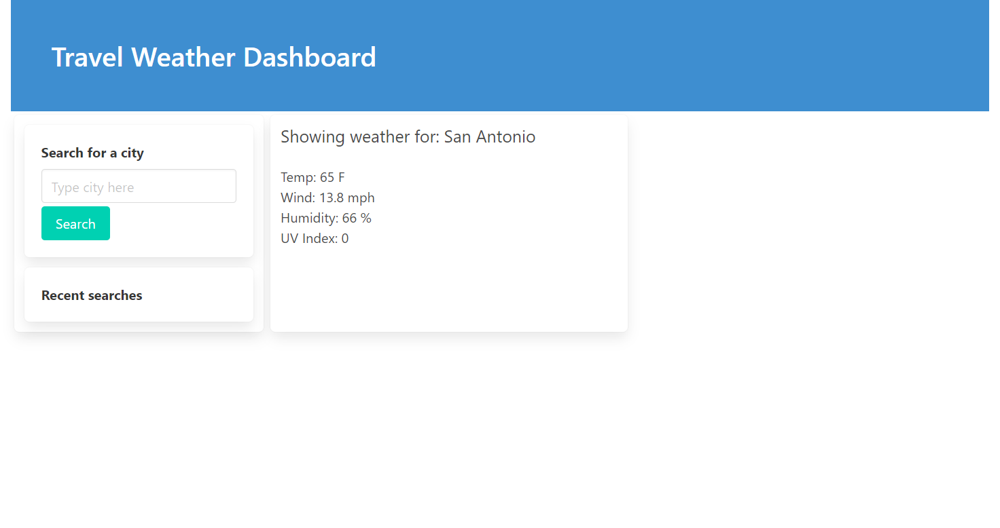

# Travel Weather Outlook

## Simple weather outlook app for planning travel

## Purpose
User Story: AS A traveler I WANT to see the weather outlook for multiple cities SO THAT I can plan a trip accordingly

## Table of Contents
### General Info
### Technologies
### Setup
### Screenshot

## General info
This is a simple web-based application to find weather of a searched city to determine the weather of the city a user might wish to visit. User is presented with a simple search function and can enter the destination city. Upon searching for the city, the user is presented with current day weather as well as weather for the next 5 days in a forecast. User is presented with temperature, wind, humidity, and the UV index values to plan accordingly. After searching for a city, that city is saved as a recent search so the user can easily search for that city again, should they need to.

## Technologies
Project is built with:
* HTML
* JavaScript
* Moment.js
* Bulma
* OpenWeather OneCall API endpoint

## Setup
To launch the page click on the link provided below

Link to deployed location: https://kevin-foreman.github.io/travel-weather-outlook/

Screenshot: 

